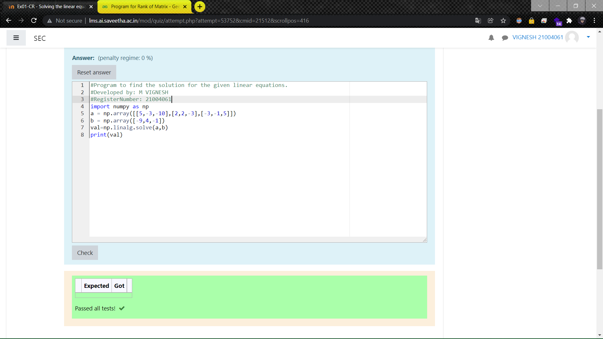

# -SOLUTION-TO-A-SYSTEM-OF-LINEAR-EQUATIONS
## Aim:
To write a python program to find a solution to a system of linear equations.
## Equipment’s required:
1. 	Hardware – PCs
2. 	Anaconda – Python 3.7 Installation / Moodle-Code Runner
## Algorithm:
### Step 1: 
Import the numpy module to use the built-in functions for calculation
### Step 2: 
Prepare the lists from each linear equations and assign in np.array()
### Step 3: 
Using the np.linalg.solve(), we can find the solutions.
### Step 4: 
End the program
## Program:
~~~
#Program to find the sloution for the given linear equation
#Developed by: M VIGNESH
#RegisterNumber: 21004061
import numpy as np 
a = np.array([[5,-3,-10],[2,2,-3],[-3,-1,5]])
b = np.array([-9,4,1])
val=np.linalg.solve(a,b)
print(val)
~~~
## Output: 

## Result: 
Thus the solutions for the linear equations are successfully solved using python program

